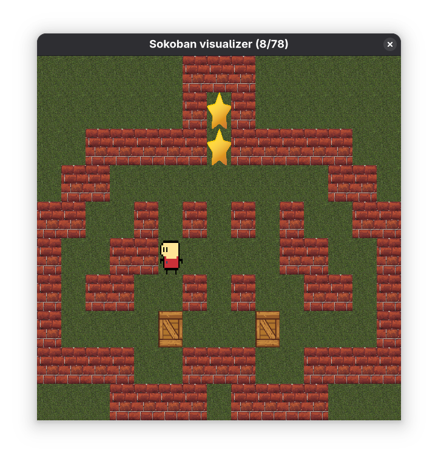

<h1 align="center">Sistemas de Inteligencia Artificial</h1>
<h3 align="center">TP1: Métodos de búsqueda</h3>
<h4 align="center">Primer cuatrimestre 2025</h4>

# Requisitos

* Python ([versión 3.12.9](https://www.python.org/downloads/release/python-3129/))
* [UV](https://docs.astral.sh/uv/getting-started/installation/)

# Instalando las dependencias

```bash
# Si python 3.12.9 no esta instalado se puede instalar haciendo
uv python install 3.12.9

# Para crear y activar el entorno virtual
uv venv
source .venv/bin/activate  # En Unix
.venv\Scripts\activate     # En Windows

# Para instalar las dependencias
uv sync
```

# Corriendo el proyecto

El proyecto consta de dos archivos _frontend_ con el cuál se puede demostrar el
funcionamiento del motor de búsquedas:

* `main.py`: recibe del input del usuario el nivel a ejecutar, el algoritmo a
utilizar y la heurística (si se elige un algoritmo que lo requiera). Ejecuta la
búsqueda, guarda el `json` recibido y lo guarda en un archivo, imprime el tiempo
que tardó y la cantidad de pasos de la solución. Luego, utilizando la librería
de `pygame`, envía la solución al visualizador para poder representarla de
manera gráfica.

* `analisis.py`: no recibe ningún imput, pero ejecuta para los niveles 1 a 3,
por cada algoritmo y cada heurística, 50 veces la búsqueda, calculando luego la
media de varios parámetros y el desvío estándar. Luego guarda los resultados en
un `json` y realiza varios gráficos que permite comparar los algoritmos.

Para ejecutar cada uno simplemente correr:

```bash
uv run main.py <level_path> <algorithm> [<heuristic>]

uv run analisis.py
```

# Utilizando el motor de búsqueda

Si se desea crear un propio frontend se puede utilizar el motor de búsqueda
diseñado. Para eso, se declaró una clase `Sokoban` que recibe en su constructor
la ubicación del archivo del nivel.

```python
from src.sokoban import Sokoban

solver = Sokoban(filename)
```

Luego, para resolver el mapa, la clase expone diferentes métodos para cada tipo
de algoritmo y heurística a utilizar

```python
# Métodos de búsqueda desinformados
solution = solver.bfs()
solution = solver.dfs()

# Métodos de búsqueda informados
from src.sokoban import heuristica_euclidean, heuristica_manhattan

heuristic = heuristica_euclidean
heuristic = heuristica_manhattan

# Para resolver por Greedy Search
solution = solver.informed_search(heuristic, False)

# Para resolver por A*
solution = solver.informed_search(heuristic, True)
```

Luego, `solution` contendrá el contenido de la solución con el siguiente
formato:

```json
{
  "map": [
    ["#", "#", "#", ...],
    ...
  ],
  "targets": [
    {
      "x": 1,
      "y": 2,
    },
    ...
  ],
  "frontier_nodes": 1,
  "expanded_nodes": 2,
  "steps": 3,
  "path": [
    {
      "player": {
        "x": 1,
        "y": 2
      },
      "boxes": [
        {
          "x": 1,
          "y": 2
        },
        ...
      ],
      "move": "UP",
    },
    ...
  ]
}
```

# Usando el visualizador

Para una buena visualización del resultado y para poder corroborar que la
solución y la secuencia de estados sean lógicas diseñamos una clase que permite
enviarle el `json` de solución y gracias a la librería de `pygame`, correr en
una ventana interactiva la simulación.



Las teclas para el visualizador son las siguientes:

| Tecla | Función |
| ----- | ------- |
| `space` | Pausa y despausa la simulación |
| `r` | Reinicia la simulación al estado inicial |
| `flecha izq.` | Pausa la simulación y retrocede un paso de la solución |
| `flecha der.` | Pausa la simulación y avanza un paso de la solución |

Para poder utilizar en código el visualizador se puede hacer:

```python
from src.visualizer import SokobanVisualizer

visualizer = SokobanVisualizer(solution)
visualizer.play_solution()
```

`solution` es el `json` que puede ser el obtenido directamente de la resolución
del mapa por medio de la clase `Sokoban` o puede ser levantado desde un archivo
en disco haciendo:

```python
import json

with open("solution.json", "r") as f:
  solution = json.load(f)
```
